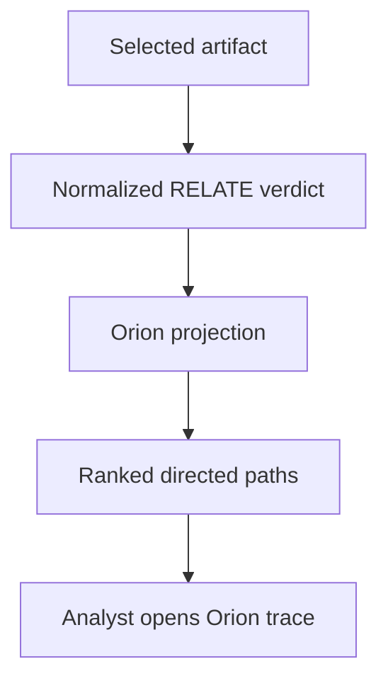

# Orion Architecture

*Architecture Constitution · Orion / Artemis · Rev. 0.2 · 22 August 2026*

> **Artemis hunts. Orion traces. Evidence proves.**

## 1. Authority and naming

This document governs the relational hunt engine inside Artemis. Chronos Corp
is the parent company. Artemis is the committed threat-hunting platform. Orion
is Artemis's relational hunt engine. Apollo is reserved for future use; older
repository names and historical documents remain implementation history, not
current product identity.

The Chronos and Artemis Constitutions remain superior governing documents.
`docs/relate-orion-contract.md` is the authoritative input contract between
RELATE and Orion.

## 2. Decision state

### LOCKED

- Orion is part of Artemis, not a separate customer product.
- Orion traces relationships. Artemis owns the complete threat-hunting
  workflow and practitioner experience.
- No trace may outrank, erase, or fabricate its evidence chain.
- Observation, sourced evidence, inference, conclusion, and action remain
  distinct layers.
- Bounded results must disclose partiality.

### DECIDED

- First Useful Trace is a deterministic Rust engine over the normalized RELATE
  contract.
- TRACE owns typed node identity, explicit directed edges, native-versus-
  reversed assertion orientation, path construction, and path ranking.
- RELATE proof chains remain attached alongside traversal paths. They are not
  reinterpreted as paths.
- Contextual filename associations are `possible` paths. Edge-backed proof
  routes are `observed` paths.
- Ranking uses an inspectable vector: relationship strength, weakest source
  confidence, then path length. Strength and confidence are never collapsed
  into one opaque score.
- Orion has an independent resource budget and reports when it truncates.
- A dedicated graph database is not required for First Useful Trace. The
  initial engine projects the existing evidence graph contract in memory.
- The first executable HUNT pivot accepts only a hash-pinned seed, one opaque
  server-generated trace-path identity, and an explicit local subtree.
- HUNT reconstructs RELATE and TRACE on the Rust side under one intelligence
  snapshot. The IPC caller cannot supply a target, proof chain, direction, or
  evidence role.
- Observed matching paths are confirming evidence. Possible matching paths are
  contextual evidence. Absence of a match is inconclusive, never contradiction.

### HYPOTHESIS

- The same directed path contract can become the stable input to recursive
  Hunt and Execute without redesigning RELATE.
- An in-memory projection is sufficient until cross-artifact, cross-session,
  or fleet-scale path workloads demonstrate the need for persisted graph
  materialization.

### OPEN

- The first reusable Hunt Pack beyond the current exact-path/local-subtree
  request, including authorization and transport for remote execution.
- Whether Orion eventually persists a derived traversal graph or continues to
  query the shared Chronos Evidence Graph directly.
- Path ranking beyond the first transparent rank vector, including temporal
  freshness, analyst intent, contradiction, and scope cost.
- Cross-host and external-telemetry node identity.
- How possible paths graduate to observed paths after hunt execution.

### EVIDENCE REQUIRED

- Practitioner use of the first trace view: which relationship is selected,
  whether the path is understood, and whether it leads to a useful next hunt.
- Performance and memory measurements across realistic relationship and proof
  cardinalities before adopting graph-specific infrastructure.
- Real Hunt Pack execution showing that the current node and edge contract can
  express typed falsifying evidence without treating absence as contradiction.

## 3. Responsibility boundary

| Layer | Owns | Must not do |
| --- | --- | --- |
| RELATE | Evidence-backed concepts, strength, provenance, time, source identity, proof chains, partiality | Promise traversal direction or path ranking |
| Orion TRACE | Typed nodes, directed edges, assertion orientation, observed/possible paths, ranking, trace bounds | Invent relationships or parse explanation prose as fact |
| Artemis HUNT | Apply a selected relationship hypothesis to a chosen scope | Treat trace existence as proof of compromise |
| Execute | Run approved collection/detection actions and return observations | Erase authorization, scope, or action auditability |

## 4. First Useful Trace

The first engine slice begins with one authoritative `Verdict` and produces an
`OrionTrace` in the same resolve operation. The frontend only renders the
directed result. It does not reconstruct graph semantics.

An `OrionTrace` contains:

- one typed start node for the selected artifact;
- zero or more directed `TracePath` objects;
- ordered nodes and edges for every emitted path;
- explicit native, reversed, or synthetic assertion orientation per edge;
- the complete supporting RELATE proof chain beside the path;
- an observed-or-possible path state;
- an inspectable rank vector;
- untraced relationship diagnostics when Orion refuses to guess;
- input and engine truncation state.

## 5. Current path projections

| RELATE relationship | Proof shape | Orion traversal |
| --- | --- | --- |
| IOC | `ObservedInReport` | Artifact → Indicator; report assertion retained as supporting proof |
| Detection | `DetectsIndicator` | Artifact → Indicator → Detection; second edge explicitly reverses the native Detection → Indicator assertion |
| CVE via report | `ObservedInReport`, `ReportReferencesCve` | Artifact → Indicator → Report → CVE |
| CVE via detection | `DetectsIndicator`, `DetectionCoversCve` | Artifact → Indicator → Detection → CVE; indicator-to-detection is explicitly reversed |
| Malware family | `AttributedToMalwareFamily` | Artifact → Indicator → Malware family |
| Contextual risk | `ContextualFilenameMatch` | Artifact → Risk concept, marked possible and synthetic |

Declared relationship kinds without a safe implemented projection remain
untraced with a machine-readable reason. Orion fails closed instead of
inferring a path from target text or prose.

## 6. Identity and direction

Every node has a typed namespace and a length-prefixed stable identifier.
Separators inside filenames, rule names, report titles, or concept values
cannot alias another node identity.

Every edge is directed from `from` to `to`. `assertion_orientation` says how
that traversal relates to the underlying evidence assertion:

- `native`: traversal follows the assertion as stored;
- `reversed`: traversal intentionally follows the assertion backward;
- `synthetic`: Orion bridges from the selected artifact or represents a
  contextual possibility rather than claiming a native stored edge.

## 7. Ranking and bounds

Orion ranks paths by:

1. relationship strength, strongest first;
2. weakest source confidence along the proof, highest first;
3. directed hop count, shortest first;
4. stable typed and lexical tie-breakers.

The components remain separate in the wire object. A low-confidence direct
hash relationship remains direct; a high-confidence filename association
remains weak.

The initial engine budget is 100 paths. Selection is fair by relationship:
each relationship receives a first path before a noisy relationship receives
a second. Candidate paths are ranked inside each relationship before that
fair allocation, so applying the budget cannot retain a weaker proof merely
because RELATE returned it first. Orion reports its omitted path count
independently from RELATE's omitted concepts or evidence.

## 8. Security and integrity rules

- Orion consumes only the authoritative, normalized Rust-side RELATE result.
- The UI never supplies or rewrites graph direction.
- Mixed proof shapes, missing identities, inconsistent endpoints, and unknown
  projections produce explicit `untraced_relationships` diagnostics.
- Current detection observations require a concrete effective rule
  fingerprint. Only the scope of a `DetectionCoversCve` assertion may use the
  deliberate any-version sentinel, and a concrete coverage fingerprint must
  equal the observation fingerprint.
- Relationship targets and shared multi-hop endpoints must agree exactly;
  Orion never synthesizes a missing proof-node identity from target text.
- Reversed traversal is visible to the analyst.
- Contextual matches never render as observed graph facts.
- Partial upstream evidence remains partial downstream.
- No path is a compromise verdict by itself.

## 9. First executable pivot

An analyst can apply one visible Orion path to the current filesystem subtree.
The request is intentionally selector-only:

- the selected file path;
- the SHA-256 observed when TRACE was rendered;
- the opaque identity of the exact selected `TracePath`;
- a declared subtree root.

The Rust backend canonicalizes and bounds the scope, re-resolves the seed,
checks that its content hash is unchanged, and requires the path identity to
select exactly one freshly reconstructed path. A missing or duplicate selector
fails closed. The backend then applies the selected typed target to candidate
artifacts through the existing authoritative resolver; the frontend never
defines graph semantics.

One intelligence read guard spans seed reconstruction and every candidate, so
a feed sync cannot split a hunt across different evidence corpora. Filesystem
execution descends from one retained authorized-root capability, refuses
symlink/reparse traversal, and retains only bounded relative paths during
discovery. Candidates are opened and snapshotted sequentially, bounding
aggregate memory to one candidate snapshot rather than the complete scope.
Hashing and all analysis consume the same immutable bytes. Handle identity
plus a root-relative no-follow stability gate runs before analysis side
effects, making replacement, mutation, or boundary uncertainty inconclusive;
candidate content is never reopened by pathname.

The selected seed is acquired through that same retained root capability and
resolved from one immutable snapshot. Its hash pin is checked before any
cache, YARA, or database effect, so seed-path replacement cannot redirect the
hypothesis reconstruction even when external content has the expected bytes.

Initial bounds are 1,000 candidate files, 20,000 walked entries, 100 returned
findings, and 100 returned errors. Every fired bound and omitted count is
returned. File contents remain on the host; only hashes, paths, typed proof,
counts, errors, and timing cross the desktop IPC boundary.

The result groups evidence by role:

- an `observed` matching path is confirming;
- a `possible` matching path is contextual;
- contradiction remains representable but is not emitted until Orion has a
  typed falsification primitive.

The exact contract and threat analysis live in
`docs/orion-hunt-contract.md`.

## 10. Implementation boundary

The reusable engine lives in `crates/nsic-core/src/orion.rs`. The authoritative
desktop resolver adds the resulting `OrionTrace` beside its normalized verdict
and YARA coverage. The React interface reveals the already-built path for the
exact relationship selected by the analyst.

No migration, new database, external graph service, AI inference, Hunt Pack
language, remote execution backend, or fleet scope is introduced by this slice.

## 11. Post-merge architecture gate

PR #23 is merged on Artemis `main` at
`31e41e98f6cc643de2a2ae7f8ac58cf60b423231`. The First Executable HUNT
Pivot is the accepted guided-pivot baseline.

The constitutional reconciliation is recorded in
`docs/orion-constitution-reconciliation.md`. It classifies the merged slice
as conforming with declared partial scope and establishes the admission rules
for future nodes, edges, evidence references, trace identities, and selectors.

The next Orion gate is the proposed structured Hunt Query contract in
`docs/orion-hunt-query-contract.md`:

1. preserve the current exact-path, server-reconstruction, and evidence
   doctrine;
2. represent analyst intent as a strict versioned data contract, not a new
   practitioner query language;
3. separate request, authorized execution plan, observation, evidence role,
   and interpretation;
4. require typed fields and operators, three-outcome evaluation, deterministic
   bounds, corpus receipts, and fail-closed backend capability negotiation;
5. retain provenance and partiality when query observations enter Orion;
6. allow YARA, Sigma, SQL, KQL, EQL, osquery, and external systems to remain
   native standards or backend languages behind explicit adapters;
7. prohibit implementation until the proposed contract is reviewed and
   accepted.

Artemis Threat Intelligence may prepare the first governed KEV-backed Hunt
Pack in parallel. Threat Intelligence owns the truth and qualification of that
content. OA owns only its graph, selector, evidence-role, and execution-contract
compatibility. Artemis Engineering owns implementation after acceptance.

A dedicated graph database, cross-host execution, Retrotrace retention,
practitioner-facing textual syntax, and commercial entitlements remain open.
They require evidence and separate authorization.
